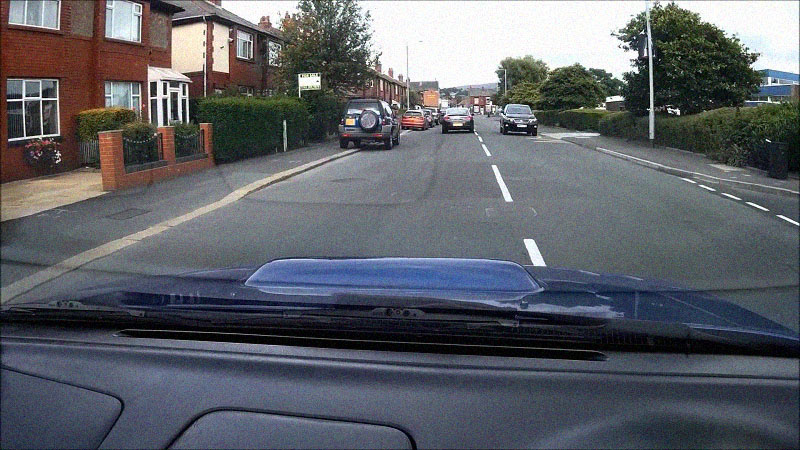
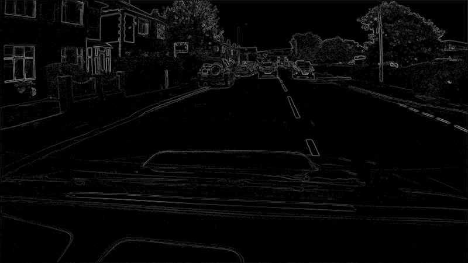
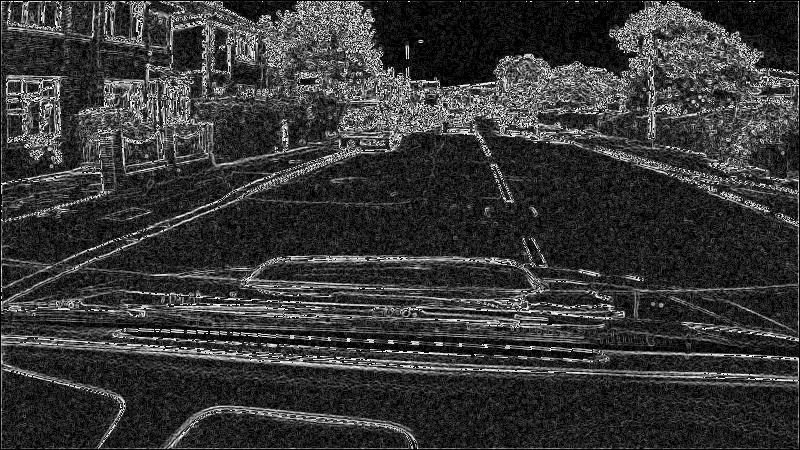
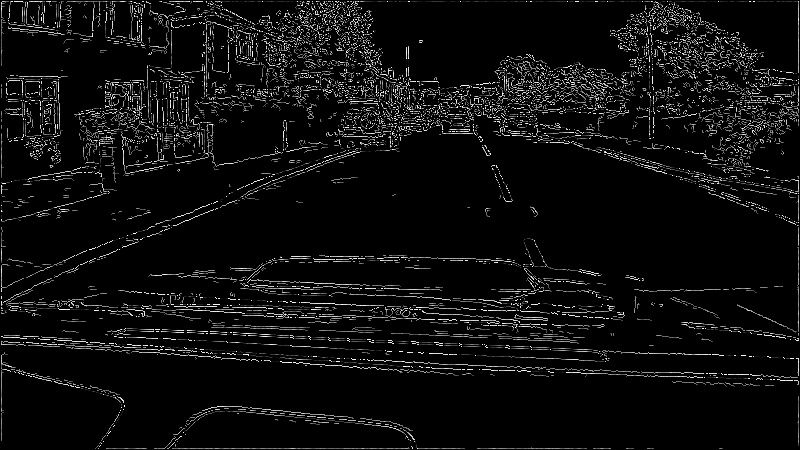

# Canny-Edge-Detector
Implementation of Canny Edge Detector in C++

# Algorithm

Original image

Finding the intensity gradient of the image and thresholding *without* denoising by sobel

Finding the intensity gradient and thresholding *with* denoising by sobel

Canny detector
1. Finding the intensity gradient and denoising by sobel
2. Non-maximum suppression
3. Double threshold
4. Edge tracking by hysteresis (only pixels with at least one strong pixel in the neighbourhood are marked as strong pixels). 

